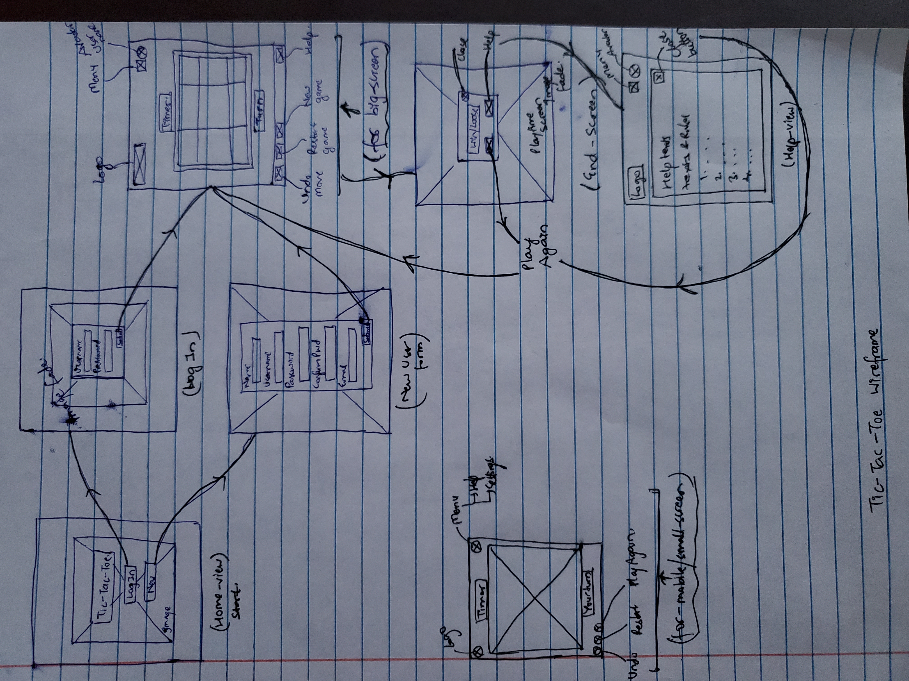

# Ticky-Tacky (O-X-O)

This is a simple application, that allows 2 users to play Tic-Tac-Toe. This application showcases the uses of JQuery event handlers, basic bootstrap modeling and API call requests.

## Links
**Deployed Application :**

**API USER documentation :** <https://git.generalassemb.ly/ga-wdi-boston/game-project-api/blob/master/docs/user.md>

**API GAME documentation :** <https://git.generalassemb.ly/ga-wdi-boston/game-project-api/blob/master/docs/game.md>

## Technologies Used
- HTML/CSS
- JQuery
- AJAX
- JS
- Bootstrap
- SCSS

## Planning Story
This application uses the Single Page Application (SPA) concept. There are many user-views in the application but the whole application is technically just a single page. The whole application can be broken down into 2 major parts which has smaller modules of their own. In general, app can be divided as:
1. API requests
	  a. User Authorization-
	  - Sign Up
	  -  Sign In
	  - Password Change
	  - Sign Out

	b. Game Process-
	- Create game
	- Update game data
     - Access previous games
       - All games
       - Completed games
        - Incomplete games
        - Particular game by ID
      - Delete game

3. UI
	- UI for all user authorization process.
   - UI for game board to play game
   - UI for game results
   - UI to showcase previous game data

All API request call is verified first using curl scripts following the API documentation. Then each request is made as required upon trigger by event handlers using AJAX and JQuery.

Basic structure of the application is built using HTML on top of which CSS and SASS is used as styling. Bootstrap is used with HTML to build the structure as well as styling in most part of the application. JQery is used for attaching event handlers to the elements for functionality and JS is used for building functionality of the game.

UI for user authorization (sign up/ sign in) is such that the access to game and other user account functions are not available without first signing in. .hide() and .show() are used to make that possible. The elements of the application that are not to be presented before user authorization is hidden using .hide(), which is presented using .show() once logged in.

Once logged in, the game interface of the game is presented and API call to create a new game is made. The game board is just a bunch of `
` with bootstrap to get the look of a tic-tac-toe board. Each `
` is attached with event handler that
1. call API request to update the game
2. Check for WIN/LOSS/TIE
3. Display player sign on board
4. Alternate current user

A navigation bar at the top of the view has user account functions (change password, view previous games, help, sign out) which is separated from main game view using bootstrap modal dialog boxes. Modals are a good way to separate contents that are to be displayed only on certain conditions.

## User Stories
- As a user, I want simple, easy user layout so that i can concentrate on the game.
- As a user, I want to see if i won, lost or the game was a tie.
- As a user, I want a help/rule book so i can read rules of games.
- As a user, I want to start another game after one game ends
- As a user, I want to choose what sign i want to start with.
- As a gamer, I want to see my past records and achievements so that I can see my progress.
- As a user, I want to have an account where i can see all my games.
- As a user, I want to be able to continue previous games.
- As a user, I want to be able to delete previous games.
___
## Unsolved Problems
- Still need to work on selecting and delete a game.
- Would like to make user able to continue previous games.
- Would like to have computer as a player.
- Would like a dark and light mode toggle.
___
## Images

**Initial Wireframe:**
